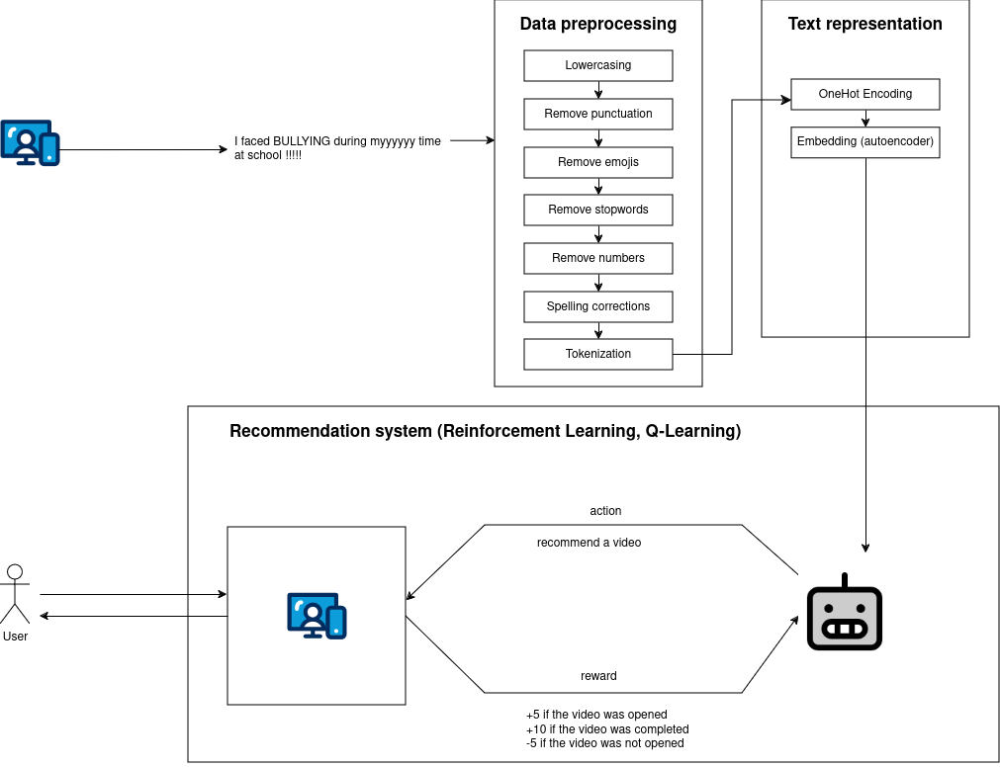

# Notes.AI: NLP and Reinforcement Learning-Based Web App for Video Recommendations on Psychological Wellness

Notes.AI is a web application designed to help users deal with their psychological struggles by recommending personalized video and podcast content. By leveraging **natural language processing (NLP)** and **reinforcement learning (RL)**, the system suggests relevant stories and experiences of individuals who have gone through similar challenges, promoting mental health awareness and providing a sense of connection and support.

The main functionality of the app involves:
 1. Processing textual data
 2. Reducing processed data dimensionality via an autoencoder
 3. Training a Q-learning agent to recommend video content.

  

# Key Features
### 1. Data Preprocessing pipeline
  
 Cleanses text by removing unnecessary noise such as punctuation, numbers, irrelevant words, stopword and repetitive characters.
    
### 2. Autoencoder for Embedding Generation
 
 Compresses high-dimensional text vectorizations (OneHot) into concise, informative embeddings.

### 3. Reinforcement Learning-based Video Recommendations

 Trains a Q-learning agent to optimize video selection by simulating user interactions.
    
### 4. User-Friendly Web Application utilizing our NLP\RL models

A user-friendly web app that allows users to input their psychological struggles and receive relevant content based on their needs.

# In-Depth Guide

## 1. Text Preprocessing

 Input: Raw text strings from the dataset.
 Processing Steps:
 Convert text to lowercase, remove punctuation and numbers.
  1. Eliminate common stopwords and retain meaningful English words.
  2. Tokenize text into individual words.
 Output: A cleaned and tokenized version of the input text.

## 2. Dimensionality Reduction

 * The processed text is transformed into a one-hot encoded matrix using CountVectorizer.
 * An autoencoder neural network compresses the matrix into a low-dimensional representation while retaining semantic relevance.
 * These embeddings serve as input states for the Q-learning agent.

## 3. Reinforcement Learning
 **Agent Setup:**
 The state space consists of embeddings representing video data. The action space includes combinations of video IDs that the agent can recommend.
 
 **Training:**
 The agent learns through simulated user interactions, guided by a reward mechanism: 
  * Positive rewards for engaging recommendations (e.g., watched or completed videos).
  * Penalties for irrelevant or unengaging recommendations.

 **Output:**
 A trained Q-learning agent capable of making intelligent video recommendations.

